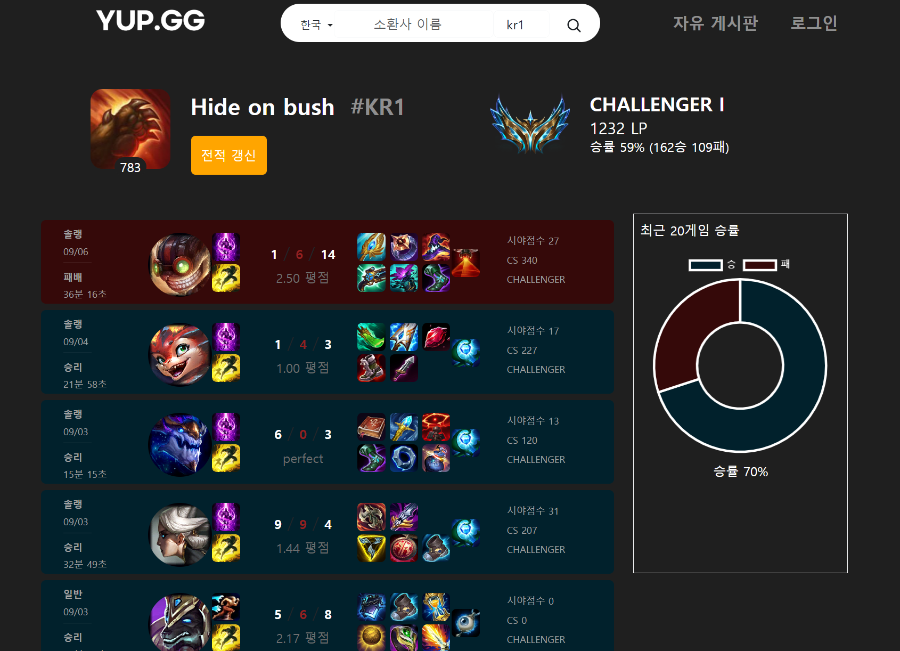
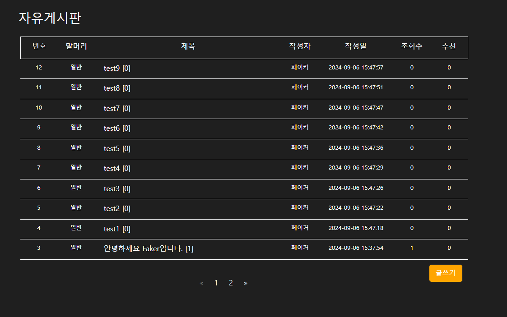

<!-- logo -->

<h3>YupGG - 리그오브레전드 전적검색 ⚡</h3>

 

## 📝 소개
**YupGG**는 RiotGames API를 활용한 리그오브레전드 전적검색 사이트 입니다.

- 최근 게임 전적 검색 💁🏻‍♀️
- 자유게시판을 통한 커뮤니티 활성화 😂

 

### 화면 구성

 

## ⚙ 기술 스택
### Front-end

  
  
  
  

### Back-end

  
  
  

